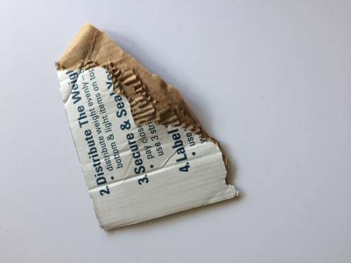
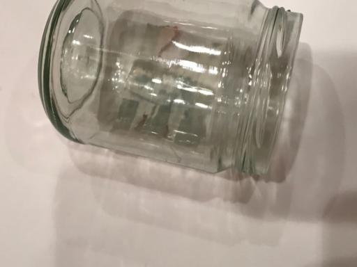
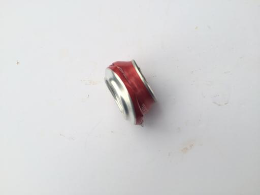
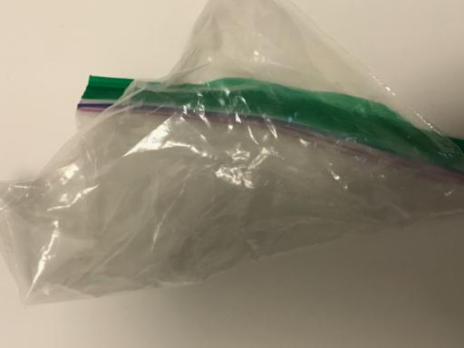

# Waste classfication

## Problem

One of the major challenges in sorting waste at the source is most people are still not properly informed about waste segregation. Artificial intelligence has advanced to a level where I think it can assist humans in quickly sorting junk.

<p float="left">
  
   
  
</p>

<p float="left">
  
   
  
</p>

## Experiments
1. **Dataset**

In order to recognize waste in wild, I train models on the dataset which similar to the real world scenario. [Trashnet](https://github.com/garythung/trashnet) is the dataset to be used to train models. It consists of 2527 images categorize into 6 classes: 

* 501 glass
* 594 paper
* 403 cardboard
* 482 plastic
* 410 metal
* 137 trash
 
For more details, please check the repository.

In order to mimic the real world environment, I applied some augmentation technique like `RandomBrightnessContrast`, `ISONoise`, `Blur`, `RandomFog` with the help of [albumentation](https://github.com/albumentations-team/albumentations).

2. **Models**

I experiment with various Classification models: 

* ConvNeXt
* ResNet 50
* ResNet DINO
* ViT
* ViT-MAE

The accuracy on test set is impressive, these models get F1 score at 9x%. But when I test it with the real world images, most of the cases it failed. I'm still working on finding a better solution.

## Training & Testing
1. Install dependecies
```
pip install -r requirements.txt
```

2. Check the [notebook](./main.ipynb) for more details

## Run the API
1. Build the docker image
```
bash build.sh
```

2. Run the container
```
bash run.sh
```

3. Inside the container, execute the following command to run the api
```
bash run_api.sh
```